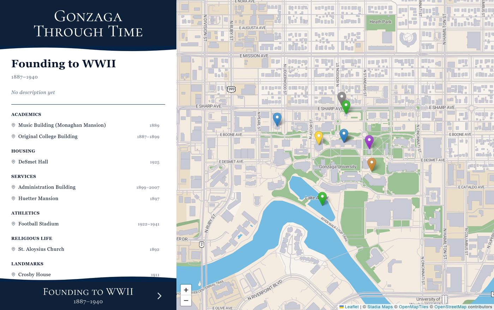

# Gonzaga Historical Map

An interactive map of Gonzaga University's campus across five time periods, from the university's
founding in 1887 to the present. Choosing a period redraws the map with the buildings, statues, and
landmarks that stood during those years, and the sidebar lists them by category with the years each
one existed.



The five periods are Founding to WWII (1887-1940), WWII to 75th Anniversary (1941-1960),
Centennial Anniversary (1961-1987), Building Blitz (1988-2010), and Modern GU (2011 to the
present). A location appears in every period between the year it was built and the year it was
demolished, so nothing has to be entered twice.

The locations are in place. The per-period photographs, captions, and descriptions are not written
yet, since `src/data/snapshots.js` is still empty, and that is why a period reads "No description
yet" in the sidebar. [EDITING.md](./EDITING.md) is the guide for adding both.

Built with React, Vite, and Leaflet.

## First-time setup

Install [Node.js](https://nodejs.org) (the LTS version is fine). Then,
in a terminal:

1. Clone the repo:

   ```
   git clone https://github.com/Carson-Frost/Gonzaga-Historical-Map.git gu-historical-map
   cd gu-historical-map
   ```

2. Install dependencies (one-time):

   ```
   npm install
   ```

## Running the app

```
npm run dev
```

The terminal prints a local address (usually `http://localhost:5173`).
Open that in a browser. The page reloads automatically when content
files are edited. `Ctrl+C` in the terminal stops it.

## Adding/editing historical data and content

See [EDITING.md](./EDITING.md).

## Project layout

- `src/data/` — historical content and data.
- `public/` — static files (images, favicons).
- `src/components/` — UI code.
- `src/config/` — map bounds and dev-mode toggles.
- `src/lib/` — code that joins the data files together.
